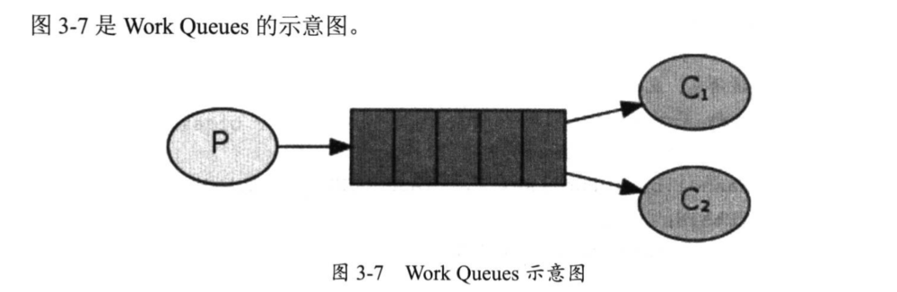
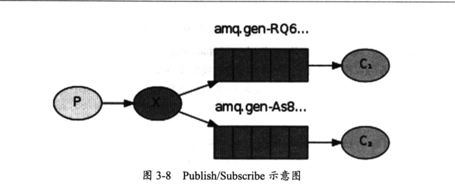
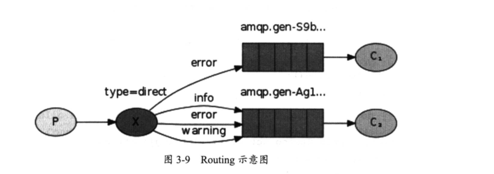
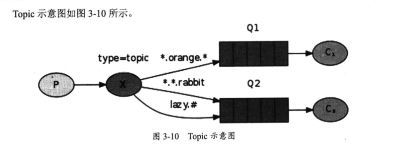
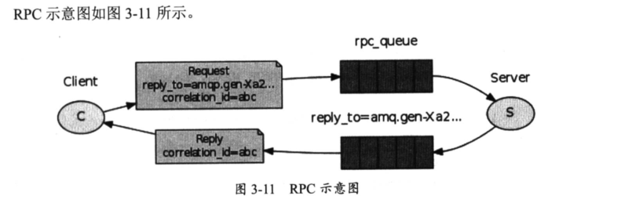

# RabbitMQ

## 例子：Work Queues
Work Queues(工作队列)又叫作Task Queues(任务队列)，我们将任务封装成消息发送到队列中。
一个Work 工作者进程在后台运行，获取任务并执行任务，当多个Work进程工作时，所有任务将被他们共享。

NewTask.java（生产者）


``` 
import org.slf4j.Logger;
import org.slf4j.LoggerFactory;

import com.rabbitmq.client.Channel;
import com.rabbitmq.client.Connection;
import com.rabbitmq.client.ConnectionFactory;
import com.rabbitmq.client.MessageProperties;

public class NewTask {
    private static final Logger LOGGER = LoggerFactory.getLogger(NewTask.class);
    private static final String TASK_QUEUE_NAME = "java01_queue";

    public static void main(String[] argv) throws Exception {

        // 初始化连接工厂
        ConnectionFactory factory = new ConnectionFactory();

        // 设置rabbitmq 服务器的连接的地址
        factory.setHost("172.16.72.19");

        // 获得连接
        Connection connection = factory.newConnection();

        // 创建 Channel
        Channel channel = connection.createChannel();

        // 声明队列
        channel.queueDeclare(TASK_QUEUE_NAME, true, false, false, null);

        // 从控制台参数中，获取消息
        String message = getMessage(argv);

        // 发送消息。发送10条
        for (int i = 0; i < 10; i++) {
            String msg = message + " " + i;
            channel.basicPublish("", TASK_QUEUE_NAME, MessageProperties.PERSISTENT_TEXT_PLAIN,
                    (msg).getBytes("UTF-8"));

            LOGGER.info(" [x] Sent '" + msg + "'");
        }

        channel.close();
        connection.close();
    }

    private static String getMessage(String[] strings) {
        if (strings.length < 1)
            return "Hello World!";
        return joinStrings(strings, " ");
    }

    private static String joinStrings(String[] strings, String delimiter) {
        int length = strings.length;
        if (length == 0)
            return "";
        StringBuilder words = new StringBuilder(strings[0]);
        for (int i = 1; i < length; i++) {
            words.append(delimiter).append(strings[i]);
        }
        return words.toString();
    }
}

```

在rabbitmq上可以查看到队列已经入队。10个消息
``` 
[root@172-16-72-19 compose]# rabbitmqctl list_queues
WARNING: ignoring /etc/rabbitmq/rabbitmq.conf -- location has moved to /etc/rabbitmq/rabbitmq-env.conf
Listing queues ...
java01_queue	10
task_queue	0
...done.

```

Worker.java (消费者).我们创建2个Worker消费者。

举例1
``` 
package Worker1;

import com.rabbitmq.client.*;
import org.slf4j.Logger;
import org.slf4j.LoggerFactory;

import java.io.IOException;

public class Worker01 {
    private static final Logger LOGGER = LoggerFactory.getLogger(Worker01.class);
    private static final String TASK_QUEUE_NAME = "java01_queue";

    public static void main(String[] argv) throws Exception {

        // 初始化连接工厂
        ConnectionFactory factory = new ConnectionFactory();

        // 设置rabbitmq 服务器的连接的地址
        factory.setHost("172.16.72.19");

        // 获得连接
        final Connection connection = factory.newConnection();

        // 创建 Channel
        final Channel channel = connection.createChannel();

        // 声明队列,第二个参数表示持久化
        channel.queueDeclare(TASK_QUEUE_NAME, true, false, false, null);
        channel.basicQos(1);

        LOGGER.info(" [*] Waiting for messages. To exit press CTRL+C");

        // 消费者
        final Consumer consumer = new DefaultConsumer(channel) {
            @Override
            public void handleDelivery(String consumerTag, Envelope envelope, AMQP.BasicProperties properties,
                                       byte[] body) throws IOException {
                String message = new String(body, "UTF-8");

                LOGGER.info(" [x] Received '" + message + "'");
                try {
                    doWork(message);
                } finally {
                    LOGGER.info(" [x] Done");

                    // 确认消息
                    channel.basicAck(envelope.getDeliveryTag(), false);
                }
            }
        };

        // 取消 autoAck
        channel.basicConsume(TASK_QUEUE_NAME, false, consumer);
    }

    private static void doWork(String task) {
        for (char ch : task.toCharArray()) {
            if (ch == '.') {
                try {
                    Thread.sleep(1000);
                } catch (InterruptedException _ignored) {
                    Thread.currentThread().interrupt();
                }
            }
        }
    }
}

```


· 生产者NewTask发送了10条消息。两个消费者Work在接受消息时，对消息进行了均衡。这就是任务队列的优势之一，
可以很容易地并行处理，还有一点。两个消费者之间互相共享数据。

使用的是Maven创建的项目，自动导入包

pom.xml文件如下
``` 
<?xml version="1.0" encoding="UTF-8"?>
<project xmlns="http://maven.apache.org/POM/4.0.0"
         xmlns:xsi="http://www.w3.org/2001/XMLSchema-instance"
         xsi:schemaLocation="http://maven.apache.org/POM/4.0.0 http://maven.apache.org/xsd/maven-4.0.0.xsd">
    <modelVersion>4.0.0</modelVersion>

    <groupId>rabbitmq-demo</groupId>
    <artifactId>rabbitmq-demo</artifactId>
    <version>1.0-SNAPSHOT</version>
    <dependencies>

        <dependency>
            <groupId>com.rabbitmq</groupId>
            <artifactId>amqp-client</artifactId>
            <version>5.8.0</version>
        </dependency>

        <dependency>
            <groupId>org.apache.logging.log4j</groupId>
            <artifactId>log4j-core</artifactId>
            <version>2.6.2</version>
        </dependency>

        <dependency>
            <groupId>org.apache.logging.log4j</groupId>
            <artifactId>log4j-api</artifactId>
            <version>2.6.2</version>
        </dependency>

        <!-- https://mvnrepository.com/artifact/org.apache.logging.log4j/log4j-slf4j-impl -->
        <dependency>
            <groupId>org.apache.logging.log4j</groupId>
            <artifactId>log4j-slf4j-impl</artifactId>
            <version>2.6.2</version>
        </dependency>


    </dependencies>

    <build>
        <plugins>
            <plugin>
                <groupId>org.apache.maven.plugins</groupId>
                <artifactId>maven-compiler-plugin</artifactId>
                <version>3.2</version>
                <configuration>
                    <source>1.7</source>
                    <target>1.7</target>
                </configuration>
            </plugin>

            <plugin>
                <groupId>org.apache.maven.plugins</groupId>
                <artifactId>maven-shade-plugin</artifactId>
                <version>2.4.3</version>
                <executions>
                    <execution>
                        <phase>package</phase>
                        <goals>
                            <goal>shade</goal>
                        </goals>
                        <configuration>
                            <transformers>
                                <transformer
                                        implementation="org.apache.maven.plugins.shade.resource.ManifestResourceTransformer">
                                    <mainClass>com.waylau.rabbitmq.Worker</mainClass>
                                </transformer>
                            </transformers>
                        </configuration>
                    </execution>
                </executions>
            </plugin>
        </plugins>
    </build>
</project>
```
##  例子：Publish/Subscribe
Publish/Subscribe(发布/订阅) 在消息队列中是一种比较常见的工作模式，该模式同事也定义了一种一对多的依赖关系。
让多个订阅者对象同时监听某一个主题对象。


该模式，producer(生产者)并不直接发送消息到queue(队列),而是发到了exchange(交换器)中。exchange一边接收来自producer的消息，
另外一边将消息插入queue中。在上一个例子中，我们并没有显式地使用exchange，我们仍然可以发送和接收消息。因为我们使用了一个默认的转发器，
它的标识符为""。

主要direct、topic、header和fanout。比如，我们要创建一个fanout类型的exchange，可以使用如下方法：
``` 
channel.exchangeDeclare('logs',"fonout");
```
fonout类型的exchange特别简单--把所有它接收到的消息广播所有它知道的队列。

EmitLog.java程序
``` 
package NewTask;
import com.rabbitmq.client.Channel;
import com.rabbitmq.client.Connection;
import com.rabbitmq.client.ConnectionFactory;
import org.slf4j.Logger;
import org.slf4j.LoggerFactory;

public class EmitLog {
    private static final Logger LOGGER = LoggerFactory.getLogger(EmitLog.class);
    private static final String EXCHANGE_NAME = "logs";

    public static void main(String[] argv) throws Exception {
        ConnectionFactory factory = new ConnectionFactory();
        factory.setHost("172.16.72.19");
        Connection connection = factory.newConnection();
        Channel channel = connection.createChannel();

        // 声明交换器和类型
        channel.exchangeDeclare(EXCHANGE_NAME, "fanout");

        String message = getMessage(argv);

        // 往交换器上发送消息
        channel.basicPublish(EXCHANGE_NAME, "", null, message.getBytes("UTF-8"));
        LOGGER.info(" [x] Sent '" + message + "'");

        channel.close();
        connection.close();
    }

    private static String getMessage(String[] strings) {
        if (strings.length < 1)
            return "info: Hello World!";
        return joinStrings(strings, " ");
    }

    private static String joinStrings(String[] strings, String delimiter) {
        int length = strings.length;
        if (length == 0)
            return "";
        StringBuilder words = new StringBuilder(strings[0]);
        for (int i = 1; i < length; i++) {
            words.append(delimiter).append(strings[i]);
        }
        return words.toString();
    }
}

```

ReceiveLogs.java 
``` 
package Public_Client;

import com.rabbitmq.client.*;
import org.slf4j.Logger;
import org.slf4j.LoggerFactory;
import java.io.IOException;

public class ReceiveLogs {
    private static final Logger LOGGER = LoggerFactory.getLogger(ReceiveLogs.class);
    private static final String EXCHANGE_NAME = "logs";

    public static void main(String[] argv) throws Exception {
        ConnectionFactory factory = new ConnectionFactory();
        factory.setHost("172.16.72.19");
        Connection connection = factory.newConnection();
        Channel channel = connection.createChannel();

        channel.exchangeDeclare(EXCHANGE_NAME, "fanout");

        // 不传递任何参数来创建一个非持久的、唯一的、动删除的队列，该队列名称由服务器随机产生。
        String queueName = channel.queueDeclare().getQueue();

        // 为交换器指定队列，设置 binding
        channel.queueBind(queueName, EXCHANGE_NAME, "");

        LOGGER.info(" [*] Waiting for messages. To exit press CTRL+C");

        Consumer consumer = new DefaultConsumer(channel) {
            @Override
            public void handleDelivery(String consumerTag, Envelope envelope, AMQP.BasicProperties properties,
                                       byte[] body) throws IOException {
                String message = new String(body, "UTF-8");
                LOGGER.info(" [x] Received '" + message + "'");
            }
        };
        channel.basicConsume(queueName, true, consumer);
    }
}

```

```
// 不传递任何参数来创建一个非持久的、唯一的、动删除的队列，该队列名称由服务器随机产生。
String queueName = channel.queueDeclare().getQueue();
```

先执行订阅者 ReceiveLogs.java 
``` 
20:45:15.158 [main] INFO  Public_Client.ReceiveLogs -  [*] Waiting for messages. To exit press CTRL+C
```

执行发布者 EmitLog.java 发送广播队列
``` 
20:45:21.074 [main] INFO  NewTask.EmitLog -  [x] Sent 'info: Hello World!'
```

订阅者收到消息队列输出
``` 
20:47:43.023 [main] INFO  Public_Client.ReceiveLogs -  [*] Waiting for messages. To exit press CTRL+C
20:47:49.096 [pool-2-thread-4] INFO  Public_Client.ReceiveLogs -  [x] Received 'info: Hello World!'
```


## 例子: Routing

Routing（路由）意味在消息订阅中选择性的订阅部分消息。比如：
我们只接受Error级别的消息写入文件。同时仍然在控制台打印所有日志。


使用direct类型的exchange，这样消息会被推送到binding key(绑定键)，和消息发布附带的routing key（路由键）完全匹配的队列。


EmitLogDirect.java
``` 
package Routing;

import com.rabbitmq.client.Channel;
import com.rabbitmq.client.Connection;
import com.rabbitmq.client.ConnectionFactory;
import org.slf4j.Logger;
import org.slf4j.LoggerFactory;

public class EmitLogDirect {
    private static final Logger LOGGER = LoggerFactory.getLogger(EmitLogDirect.class);
    private static final String EXCHANGE_NAME = "direct_logs";

    public static void main(String[] argv) throws Exception {

        ConnectionFactory factory = new ConnectionFactory();
        factory.setHost("172.16.72.33");
        Connection connection = factory.newConnection();
        Channel channel = connection.createChannel();

        channel.exchangeDeclare(EXCHANGE_NAME, "direct");

        String severity = getSeverity(argv);
        String message = getMessage(argv);

        // 为简化程序，这里 的 severity 是 inof、warning、error 中的一个
        channel.basicPublish(EXCHANGE_NAME, severity, null, message.getBytes("UTF-8"));
        LOGGER.info(" [x] Sent '" + severity + "':'" + message + "'");

        channel.close();
        connection.close();
    }

    private static String getSeverity(String[] strings) {
        if (strings.length < 1)
            return "info";
        return strings[0];
    }

    private static String getMessage(String[] strings) {
        if (strings.length < 2)
            return "Hello World!";
        return joinStrings(strings, " ", 1);
    }

    private static String joinStrings(String[] strings, String delimiter, int startIndex) {
        int length = strings.length;
        if (length == 0)
            return "";
        if (length < startIndex)
            return "";
        StringBuilder words = new StringBuilder(strings[startIndex]);
        for (int i = startIndex + 1; i < length; i++) {
            words.append(delimiter).append(strings[i]);
        }
        return words.toString();
    }
}
```

ReceiveLogsDirect.java
``` 
package Routing;

import java.io.IOException;

import org.slf4j.Logger;
import org.slf4j.LoggerFactory;

import com.rabbitmq.client.AMQP;
import com.rabbitmq.client.Channel;
import com.rabbitmq.client.Connection;
import com.rabbitmq.client.ConnectionFactory;
import com.rabbitmq.client.Consumer;
import com.rabbitmq.client.DefaultConsumer;
import com.rabbitmq.client.Envelope;

/**
 * 日志接收程序
 *
 * @author <a href="https://waylau.com">waylau.com</a>
 * @date 2016年8月13日
 */
public class ReceiveLogsDirect {

    private static final Logger LOGGER = LoggerFactory.getLogger(ReceiveLogsDirect.class);

    private static final String EXCHANGE_NAME = "direct_logs";

    public static void main(String[] argv) throws Exception {
        ConnectionFactory factory = new ConnectionFactory();
        factory.setHost("172.16.72.33");
        Connection connection = factory.newConnection();
        Channel channel = connection.createChannel();

        channel.exchangeDeclare(EXCHANGE_NAME, "direct");
        String queueName = channel.queueDeclare().getQueue();

        if (argv.length < 1) {
            LOGGER.error("Usage: ReceiveLogsDirect [info] [warning] [error]");
            System.exit(1);
        }

        // 每一个我们感兴趣的 severity 创建一个新的绑定
        for (String severity : argv) {
            channel.queueBind(queueName, EXCHANGE_NAME, severity);
        }

        LOGGER.info(" [*] Waiting for messages. To exit press CTRL+C");

        Consumer consumer = new DefaultConsumer(channel) {
            @Override
            public void handleDelivery(String consumerTag, Envelope envelope, AMQP.BasicProperties properties,
                                       byte[] body) throws IOException {
                String message = new String(body, "UTF-8");
                LOGGER.info(" [x] Received '" + envelope.getRoutingKey() + "':'" + message + "'");
            }
        };
        channel.basicConsume(queueName, true, consumer);
    }
}

```

## 例子：Topics
topic类型的exchange拥有比dirrct类型更多的灵活性，topic exchange的routing key可以是长度不超过255 bytes的字符，其格式是以点号
"."进行分割的，支持简单的正则，两个比较重要的字符如下：

· * 代表任意一个单词；

· # 代表0个或多个单词；



EmitLogTopic.java
``` 
package Topics;

import com.rabbitmq.client.ConnectionFactory;
import com.rabbitmq.client.Connection;

import org.slf4j.Logger;
import org.slf4j.LoggerFactory;

import com.rabbitmq.client.Channel;

/**
 * 日志发送程序
 *
 * @author <a href="https://waylau.com">Way Lau</a>
 * @date 2016年8月13日
 */
public class EmitLogTopic {

    private static final Logger LOGGER = LoggerFactory.getLogger(EmitLogTopic.class);
    private static final String EXCHANGE_NAME = "topic_logs";

    public static void main(String[] argv) {
        Connection connection = null;
        Channel channel = null;
        try {
            ConnectionFactory factory = new ConnectionFactory();
            factory.setHost("172.16.72.33");

            connection = factory.newConnection();
            channel = connection.createChannel();

            // 声明一个 topic 类型的 exchange
            channel.exchangeDeclare(EXCHANGE_NAME, "topic");

            String routingKey = getRouting(argv);
            String message = getMessage(argv);

            channel.basicPublish(EXCHANGE_NAME, routingKey, null, message.getBytes("UTF-8"));
            LOGGER.info(" [x] Sent '" + routingKey + "':'" + message + "'");

        } catch (Exception e) {
            e.printStackTrace();
        } finally {
            if (connection != null) {
                try {
                    connection.close();
                } catch (Exception ignore) {
                }
            }
        }
    }

    private static String getRouting(String[] strings) {
        if (strings.length < 1)
            return "anonymous.info";
        return strings[0];
    }

    private static String getMessage(String[] strings) {
        if (strings.length < 2)
            return "Hello World!";
        return joinStrings(strings, " ", 1);
    }

    private static String joinStrings(String[] strings, String delimiter, int startIndex) {
        int length = strings.length;
        if (length == 0)
            return "";
        if (length < startIndex)
            return "";
        StringBuilder words = new StringBuilder(strings[startIndex]);
        for (int i = startIndex + 1; i < length; i++) {
            words.append(delimiter).append(strings[i]);
        }
        return words.toString();
    }
}
```

ReceiveLogsTopic.java
``` 
package Topics;

import com.rabbitmq.client.*;

import java.io.IOException;

import org.slf4j.Logger;
import org.slf4j.LoggerFactory;

/**
 * 日志接收程序
 *
 * @author <a href="https://waylau.com">Way Lau</a>
 * @date 2016年8月13日
 */
public class ReceiveLogsTopic {

    private static final Logger LOGGER = LoggerFactory.getLogger(ReceiveLogsTopic.class);
    private static final String EXCHANGE_NAME = "topic_logs";

    public static void main(String[] argv) throws Exception {
        ConnectionFactory factory = new ConnectionFactory();
        factory.setHost("172.16.72.33");
        Connection connection = factory.newConnection();
        Channel channel = connection.createChannel();

        // 声明一个 topic 类型的 exchange
        channel.exchangeDeclare(EXCHANGE_NAME, "topic");
        String queueName = channel.queueDeclare().getQueue();

        if (argv.length < 1) {
            LOGGER.error("Usage: ReceiveLogsTopic [binding_key]...");
            System.exit(1);
        }

        for (String bindingKey : argv) {
            channel.queueBind(queueName, EXCHANGE_NAME, bindingKey);
        }

        LOGGER.info(" [*] Waiting for messages. To exit press CTRL+C");

        Consumer consumer = new DefaultConsumer(channel) {
            @Override
            public void handleDelivery(String consumerTag, Envelope envelope, AMQP.BasicProperties properties,
                                       byte[] body) throws IOException {
                String message = new String(body, "UTF-8");
                LOGGER.info(" [x] Received '" + envelope.getRoutingKey() + "':'" + message + "'");
            }
        };
        channel.basicConsume(queueName, true, consumer);
    }
}
```

## RPC 
RPC_Server端发送一个计算的函数到RPC_Client端，
RPC_Client将计算结果通过队列返回给RPC_Server，实现远程过程调用


此处省略


