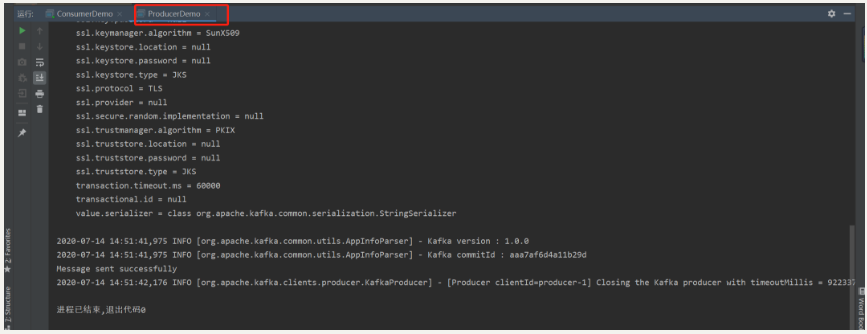
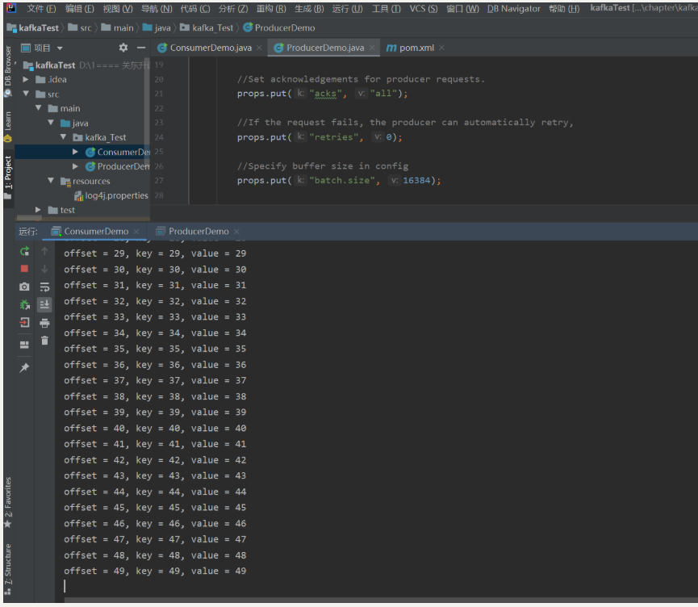
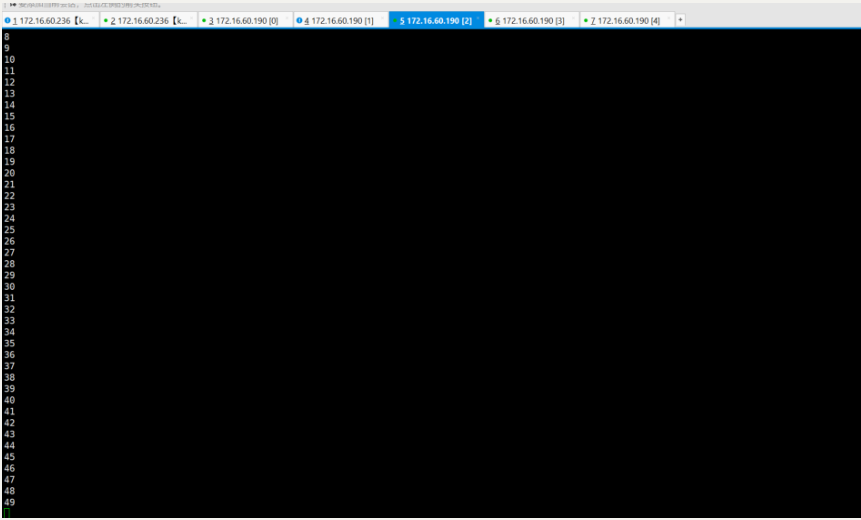

# Apache Kafka

Apache Kafka 是一种高吞吐的分布式发布订阅消息系统，可以提供消息的持久化，即使数据以TB的消息存储也能够保持长时间的文档性能，同时Kafka也支持Hadoop并行数据加载。


## Apache Kafka的安装、配置、使用


### 1.下载安装

安装包的下载地址为 <http://kafka.apache.org/downloads.html>>

这里下载的是kafka_2.13-2.5.0.tgz

```shell
tar -xzf kafka_2.13-2.5.0.tgz
cd kafka_2.13-2.5.0.
```

解压安装包kafka_2.13-2.5.0.tgz到任意安装目录，如果是unix系统，则执行安装目录下的bin目录下的脚本，如果是windows系统，则执行bin/windows目录下的脚本。

### 2.启动kafka server服务

因Kafka使用了ZooKeeper，所以，首先启动ZooKeeper（Kafka自带打包和配置好了的ZooKeeper），执行：

```shell
[root@px-master kafka_2.13-2.5.0]# ./bin/zookeeper-server-start.sh config/zookeeper.properties
```

现在启动Kafka服务：

```shell
[root@px-master kafka_2.13-2.5.0]# ./bin/kafka-server-start.sh config/server.properties &
```

### 3.创建topic

创建一个名为“test”的Topic，只有一个分区和一个备份：

```shell
[root@px-master kafka_2.13-2.5.0]# ./bin/kafka-topics.sh --create --zookeeper localhost:2181 --replication-factor 1 --partitions 1 --topic test
Created topic test.
```

创建好之后，可以通过运行以下命令，查看已创建的topic信息：

```shell
[root@px-master kafka_2.13-2.5.0]# ./bin/kafka-topics.sh --list --zookeeper localhost:2181
test
```

除了手工创建topic，我们也可以配置直接的broker，当发布一个不存在的topic时，来自动创建topic。


### 4.发送消息

Kafka提供一个命令行的工具，可以从输入文件或者命令行中读取消息并发送给Kafka集群，每一行是一条消息。

运行Producer程序，然后在控制台输入几条消息到服务器。

```shell
[root@px-master kafka_2.13-2.5.0]# bin/kafka-console-producer.sh --broker-list localhost:9092 --topic test
>asasas
>asasas
>saasa
>aasdsa
>asa
```

### 5.启动消费者

```shell
[root@px-master kafka_2.13-2.5.0]#  bin/kafka-console-consumer.sh --bootstrap-server localhost:9092 --topic test --from-beginning
This is another message
This is a message
This is another message
aaa
aaaaaaaaaaaaaaaaaaaaa
aaaaaaaaaaaaaaa
bbbbbbbbbbbbbbbbbbbbbbbbbbbbbbbbb
cccccccccccccccccc
asasas
asasas
saasa
aasdsa
asa
```

如果无法启动，根据提示，可能需要加zookeeper：

```shell
$ bin/kafka-console-consumer.sh --bootstrap-server localhost:9092 --zookeeper localhost:2181 --topic test --from-beginning
```

如果在2台不同的终端上运行上述命令，那么当运行Producer时，Consumer就能消费到Producer发送的消息。

### 6.设置多个broker集群

对于Kafka来说，一个broker仅仅是一个集群的大小，即使多设置几个broker实例也不会有大的变化，为了演示效果，我们扩展集群到三个节点。

首先为每个broker创建一个配置文件：

```shell
$ cp config/server.properties config/server-1.properties 
$ cp config/server.properties config/server-2.properties 
```

编辑这些新建的文件。

```shell
$ cat config/server-1.properties |grep -v "^#"|grep -v "^$"
broker.id=1
listeners=PLAINTEXT://:9093
log.dirs=/tmp/kafka-logs-1
```

```shell
$ cat config/server-2.properties |grep -v "^#"|grep -v "^$"
broker.id=2
listeners=PLAINTEXT://:9094
log.dirs=/tmp/kafka-logs-2
```

broker.id是集群中每个节点的唯一且永久的名称，端口和日志分区是因为多个broker现在在同一台机器上运行，我们防止broker在同一端口上注册和覆盖对方数据。

我们已经运行了Zookeeper和一个Kafka节点，所以只需要再启动2个新的Kafka节点：

```shell
$ ./bin/kafka-server-start.sh config/server-1.properties &

$ ./bin/kafka-server-start.sh config/server-2.properties &
```

现在创建一个topic，把备份设置为3

```shell
$ bin/kafka-topics.sh --create --zookeeper localhost:2181 --replication-factor 3 --partitions 1 --topic my-replic
ated-topic 

Created topic my-replicated-topic.
```

现在已经有了一个集群了，运行“describe topics”命令可以查看每个集群的状态。

```shell
$ bin/kafka-topics.sh --describe --zookeeper localhost:2181 --topic my-replicated-topic

Topic: my-replicated-topic	PartitionCount: 1	ReplicationFactor: 3	Configs: 
	Topic: my-replicated-topic	Partition: 0	Leader: 1	Replicas: 1,0,2	Isr: 1,0,2

```

这是一个解释输出，第一行是所有分区的摘要，每一个线提供一个分区信息，因为只有一个分区，所以只有一条线，其中。

* Leader ---该节点负责所有指定分区的读和写，每个节点的领导都是随机选择的；
* Replicas---备份的节点，无论该节点是否是leader或者目前是否还活着，只是显示；
* Isr----备份节点的集合，也就是活着的节点集合。

查看之前创建的单节点：

```shell
$ bin/kafka-topics.sh --describe --zookeeper localhost:2181 --topic test
Topic: test	PartitionCount: 1	ReplicationFactor: 1	Configs: 
	Topic: test	Partition: 0	Leader: 0	Replicas: 0	Isr: 0
```

由于刚才创建的topic没有Replicas，所以是0。

发布一些信息在新的topic上：

```shell
$ bin/kafka-console-producer.sh --broker-list localhost:9092 --topic myreplicated-topic
>dasdasdasda
[2020-07-14 11:48:34,231] WARN [Producer clientId=console-producer] Error while fetching metadata with correlation id 3 : {myreplicated-topic=LEAD
ER_NOT_AVAILABLE} (org.apache.kafka.clients.NetworkClient)a>dadasdasdasd
>my test message 1
>my test message 2
>adsdsa
```

现在消费这些信息：

```shell
$ bin/kafka-console-consumer.sh --bootstrap-server localhost:9092 --topic myreplicated-topic --from-beginning
dasdasdasda
adadasdasdasd
my test message 1
my test message 2
adsdsa
```

要测试集群的容错，kill掉leader，由于Broker1是当前的leader，被kill掉也就是Broker 1：

```shell
ps aux | grep server-1.properties
$ kill -9 3025
```

备节点之一成为新的leader，而Broker 1 已经不在同步备份集合里了：

```shell
$ bin/kafka-topics.sh --describe --zookeeper localhost:2181 --topic my-replicated-topic
Topic: my-replicated-topic	PartitionCount: 1	ReplicationFactor: 3	Configs: 
	Topic: my-replicated-topic	Partition: 0	Leader: 0	Replicas: 1,0,2	Isr: 0,2
```

但是消息仍然没丢

```shell
$ bin/kafka-console-consumer.sh --bootstrap-server localhost:9092 --topic myreplicated-topic --from-beginning
dasdasdasda
adadasdasdasd
my test message 1
my test message 2
adsdsa
sdasdas
```

### 7.kafka指令大全

```shell
bin/kafka-topics.sh --zookeeper localhost:2181 --list
//查看列表有那些topics

sh bin/kafka-topics.sh --delete --zookeeper localhost:2181 --topic sparkDemo
//删除topics：sparkDemo

bin/kafka-topics.sh --create --zookeeper localhost:2181 --replication-factor 1 --partitions 3 --topic sparkDemo
//创建topics：sparkDemo


bin/kafka-server-start.sh -daemon config/server.properties
//启动kafka

 
bin/kafka-console-producer.sh --broker-list localhost:9092 --topic HelloWor ld
//启动生产者


bin/kafka-console-consumer.sh --zookeeper localhost:2181 --topic HelloWorld
//启动消费者
```


### 8.用Java(idea)来测试kafka中的生产者和消费者

idea环境
打开idea并且创建maven项目。（不会的自己去百度）
**pow.xml**：

```xml
<?xml version="1.0" encoding="UTF-8"?>
<project xmlns="http://maven.apache.org/POM/4.0.0"
         xmlns:xsi="http://www.w3.org/2001/XMLSchema-instance"
         xsi:schemaLocation="http://maven.apache.org/POM/4.0.0 http://maven.apache.org/xsd/maven-4.0.0.xsd">
    <modelVersion>4.0.0</modelVersion>

    <groupId>kafkaTest</groupId>
    <artifactId>kafkaTest</artifactId>
    <version>1.0.0</version>
    <dependencies>
        <dependency>
            <groupId>org.apache.kafka</groupId>
            <artifactId>kafka_2.12</artifactId>
            <version>1.0.0</version>
        </dependency>
        <dependency>
            <groupId>org.apache.kafka</groupId>
            <artifactId>kafka-clients</artifactId>
            <version>1.0.0</version>
        </dependency>

        <dependency>
            <groupId>org.apache.kafka</groupId>
            <artifactId>kafka-streams</artifactId>
            <version>1.0.0</version>
        </dependency>
    </dependencies>


</project>
```


先关闭Kafka服务

```shell
$ bin/kafka-server-stop.sh config/server.properties &
```

修改配置文件`vim config/server.properties`

```shell
$ cat config/server.properties|grep -v "^#"|grep -v "^$"
broker.id=0
listeners=PLAINTEXT://172.16.60.190:9092
advertised.listeners=PLAINTEXT://172.16.60.190:9092
```

启动Kafka服务

```shell
$ bin/kafka-server-start.sh config/server.properties  &

$ bin/kafka-topics.sh --create --zookeeper localhost:2181 --replication-factor 1 --partitions 1 --topic HelloWorld
//创建topics：HelloWorld

$ bin/kafka-topics.sh --zookeeper localhost:2181 --list
```

Java生产者代码

`ProducerDemo.java`

```java
package kafka_Test;

import java.util.Properties;
import org.apache.kafka.clients.producer.KafkaProducer;
import org.apache.kafka.clients.producer.Producer;
import org.apache.kafka.clients.producer.ProducerConfig;
import org.apache.kafka.clients.producer.ProducerRecord;
import org.apache.kafka.common.serialization.StringSerializer;

public class ProducerDemo {
    public static void main(String[] args) {
        String topicName = "HelloWorld";//这个是创建好的topic

        // create instance for properties to access producer configs
        Properties props = new Properties();

        //这里是填你linux的ip地址:kafka的端口号
        props.put("bootstrap.servers", "172.16.60.190:9092");

        //Set acknowledgements for producer requests.
        props.put("acks", "all");

        //If the request fails, the producer can automatically retry,
        props.put("retries", 0);

        //Specify buffer size in config
        props.put("batch.size", 16384);

        //Reduce the no of requests less than 0
        props.put("linger.ms", 1);

        //The buffer.memory controls the total amount of memory available to the producer for buffering.
        props.put("buffer.memory", 33554432);

        props.put(ProducerConfig.VALUE_SERIALIZER_CLASS_CONFIG, StringSerializer.class.getName());
        props.put(ProducerConfig.KEY_SERIALIZER_CLASS_CONFIG, StringSerializer.class.getName());
        Producer<String, String> producer = new KafkaProducer<String, String>(props);

        for (int i = 0; i < 50; i++)
            producer.send(new ProducerRecord<String, String>(topicName, Integer.toString(i), Integer.toString(i)));
        System.out.println("Message sent successfully");
        producer.close();
    }
}
```



Java消费者代码 `ConsumerDemo.java`

```java
package kafka_Test;

import org.apache.kafka.clients.consumer.ConsumerRecord;
import org.apache.kafka.clients.consumer.ConsumerRecords;
import org.apache.kafka.clients.consumer.KafkaConsumer;
import org.apache.kafka.common.serialization.StringDeserializer;

import java.util.Arrays;
import java.util.Properties;

public class ConsumerDemo {
    public static void main(String[] args) throws Exception {

        //Kafka consumer configuration settings
        String topicName = "HelloWorld";//创建好的topic
        Properties props = new Properties();

        props.put("bootstrap.servers", "172.16.60.190:9092");//地址和端口号
        props.put("group.id", "test");
        props.put("enable.auto.commit", "true");
        props.put("auto.commit.interval.ms", "1000");
        props.put("session.timeout.ms", "30000");
        props.put("key.deserializer", StringDeserializer.class.getName());
        props.put("value.deserializer", StringDeserializer.class.getName());
        KafkaConsumer<String, String> consumer = new KafkaConsumer<String, String>(props);

        //Kafka Consumer subscribes list of topics here.
        consumer.subscribe(Arrays.asList(topicName));

        //print the topic name
        System.out.println("Subscribed to topic " + topicName);
        int i = 0;
        while (true) {
            ConsumerRecords<String, String> records = consumer.poll(100);
            for (ConsumerRecord<String, String> record : records)
                // print the offset,key and value for the consumer records.
                System.out.printf("offset = %d, key = %s, value = %s\n", record.offset(), record.key(), record.value());
        }
    }
}
```




查看Linux里面的消费者，然后再执行生产者的代码，也能看到消费信息：


```shell
bin/kafka-console-consumer.sh --bootstrap-server PLAINTEXT://172.16.60.190:9092 --topic HelloWorld --from-beginning
```




参考文献

<https://blog.csdn.net/weixin_42369418/article/details/103234026?utm_medium=distribute.pc_relevant.none-task-blog-BlogCommendFromMachineLearnPai2-5.compare&depth_1-utm_source=distribute.pc_relevant.none-task-blog-BlogCommendFromMachineLearnPai2-5.compare>


### 9.用Pyhton来测试Kafka生产者和消费者


<https://github.com/confluentinc/confluent-kafka-python/tree/master/examples>


