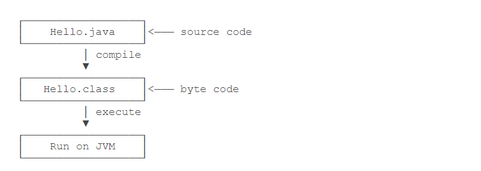

# 第一个Java程序
```
package helloJava;

public class hellojava {
	private static String say = "我 要学会你。" ;
	public static void main(String[] args) {
		// TODO 自动生成的方法存根
		System.out.println("你好Java " + say);
	}

}

//输出结果
你好Java 我 要学会你。
```

## 如何运行Java程序
Java源码本质上是一个文本文件，我们需要先用javac把Hello.java编译成字节码文件Hello.class，然后，用java命令执行这个字节码文件：


因此，可执行文件javac是编译器，而可执行文件java就是虚拟机。

第一步，在保存Hello.java的目录下执行命令javac Hello.java：
```
$ javac Hello.java
```

如果源代码无误，上述命令不会有任何输出，而当前目录下会产生一个Hello.class文件：
```
$ ls
Hello.class	Hello.java
```
第二步，执行Hello.class，使用命令java Hello：
```
$ java Hello
Hello, world!
```
注意：给虚拟机传递的参数Hello是我们定义的类名，虚拟机自动查找对应的class文件并执行。

有一些童鞋可能知道，直接运行java Hello.java也是可以的：
```
$ java Hello.java 
Hello, world!
这是Java 11新增的一个功能，它可以直接运行一个单文件源码！
```
需要注意的是，在实际项目中，单个不依赖第三方库的Java源码是非常罕见的，
所以，绝大多数情况下，我们无法直接运行一个Java源码文件，原因是它需要依赖其他的库。


## linux中java程序编译运行

<https://blog.csdn.net/weixin_40449300/article/details/86675532>


## Java主类结构
```
java 语言是面对对象的程序设计语言，java程序的基本组成单元是类，类体中又包括属性与方法两个部分
每一个应用程序都必须包含一个main()方法，含有main()方法的类成为主类。
下面介绍java主类结构
```
```
package Number;

public class Frist {
	static String s1="你好";
	public static void main(String[] args) {
		String s2 = "Java";
		System.out.println(s1);
		System.out.println(s2);
		
	}

}

//输出结果
你好
Java

```


## 包声明
```
一个java应用程序是由若干个类组成的， 语句package Number 为声明该类所在的包
package为包的关键字

```

## 声明成员变量和局部变量
```
通常将类的属性称为类的全局变量（成员变量）
将方法中的属性称为局部变量，
全局变量声明在类体中，局部变量声明在方法体中，
局部变量和全局变量有各自的应用范围，上面s1是成员变量
s2是局部变量
```

## 导入API类库
``` 
在java语言中可以通过import关键字导入相关的类，
在JDK的API中（应用程序接口）提供了130多个包。入java.awt、java.io等，
可以通过JDK的API文档来查看这些类，其中主要包括类的继承结构、类的应用成员变量表、构造方法
表等，并对每个变量的使用目的作了详细的描述，API文档是程序开发人员不可或缺的工具。
```

## 变量

```
数据类型　变量名　[=初始值];
```

**示例代码**

``` java
public class HelloWorld {
    // 声明int型成员变量
    int y; 
    public static void main(String[] args) {
    // 声明int型局部变量
    int x; 
    // 声明float型变量并赋值
    float f = 4.5f; 
    // x = 10;
    System.out.println("x = " + x);// 编译错误，局部变量 x未初始化 
    System.out.println("f = " + f);
    if (f < 10) {
        // 声明型局部变量
        int m = 5; 
    }
    System.out.println(m); // 编译错误 
}
}
```


## 常量

``` 
final 数据类型 变量名 = 初始值;
```

**示例代码**

```java
public class HelloWorld {
// 静态常量，替代保留字const
public static final double PI = 3.14; 
    // 声明成员常量
    final int y = 10; 
    public static void main(String[] args) {
    // 声明局部常量
    final double x = 3.3; 
}
}
```

