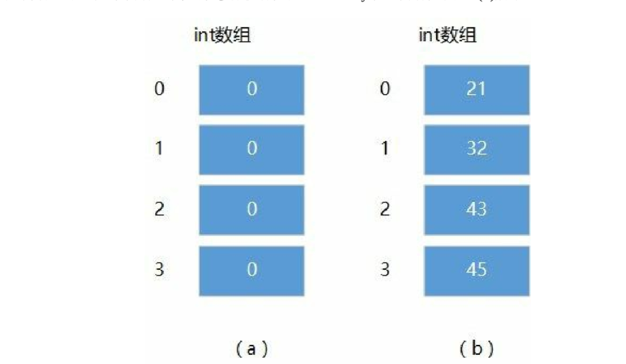
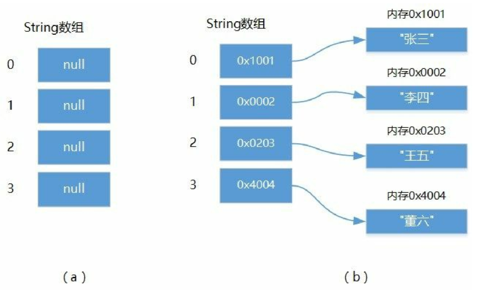

# 一维数组的创建和使用
## 一维数组

当数组中每个元素都只带有一个下标时，这种数组就是“一维数组”。数组是引用数据类型，引用数据类型在使用之前一定要做两件事情：声明和初始化。

### 01.数组声明

```
元素数据类型[] 数组变量名;
元素数据类型 数组变量名[];
```


eg

``` 


public class Demo {
	public static void main(String[] args) {
//		定义三种array初始化方法
		int a[]=new int[3];
		a[0]=1;
		a[1]=2;
		a[2]=3;
		
		int b[]= new int[] {4,5,6,7};
		int c[]= {8,9,7,6};
		
		System.out.println(a[1]);
		System.out.println(b[1]);
		System.out.println(c[1]);
		System.out.println("a数组的长度为："+a.length);
		System.out.println("b数组的长度为："+b.length);
		System.out.println("c数组的长度为："+c.length);
	}

}

# 数组的长度限制既可以是整数也可以是一个公式，
例如 
int a[]=new int[2+3];
```


- 小实验
``` 

public class array_test1 {
	public static void main(String[] args) {
		//定义数组，并进行初始化值，12个月的天数
		int month[] = new int[] {31,28,31,30,31,30,31,31,30,31,31};
//		遍历数组进行值的输出
		for (int i = 0; i < month.length; i++) {
			System.out.println(i+1+"月有"+month[i]+"天");
		}
	}

}


//输出结果
1月有31天
2月有28天
3月有31天
4月有30天
5月有31天
6月有30天
7月有31天
8月有31天
9月有30天
10月有31天
11月有31天
```

### 02.数组初始化

1. 静态初始化

   ```
   静态初始化就是将数组的元素放到大括号中，元素之间用逗号（,）分隔。
   ```

   示例代码：

   ```java
   package aom;
   
   
   public class HelloWorld {
       public static void main(String[] args) {
   //        声明数组
           int intArray[] = {11, 22, 33, 44, 55, 66};
   //        初始化数组
           String StrArray[] = {"胡1", "胡2", "胡3"};
   
   //        遍历int数组
           for (int i = 0; i < intArray.length; i++) {
               System.out.println(intArray[i]);
           }
   //        遍历String数组
           for (int i = 0; i < StrArray.length; i++) {
               System.out.println(StrArray[i]);
           }
       }
   }
   
   /*
   *
   11
   22
   33
   44
   55
   66
   胡1
   胡2
   胡3
   * */
   ```

   

2. 动态初始化

```
使用new运算符分配指定长度的内存空间

语法如下：
new 元素数据类型[数组长度] ;
```

​	示例代码:

```java
package bom;

public class HelloWorld {
    public static void main(String[] args) {
//        定义三种array初始化方法
        int a[] = new int[3];
        a[0] = 1;
        a[1] = 2;
        a[2] = 3;

        int b[] = new int[]{4, 5, 6, 7};
        int c[] = {8, 9, 10, 11, 12};
        System.out.println(a[1]);
        System.out.println(b[1]);
        System.out.println(c[1]);
        System.out.println("数组a的长度为：" + a.length);
        System.out.println("数组b的长度为：" + b.length);
        System.out.println("数组c的长度为：" + c.length);

    }
}

/*
*
2
5
9
数组a的长度为：3
数组b的长度为：4
数组c的长度为：5
* */

```

提示　new分配数组内存空间后，数组中的元素内容是什么呢？答案是数组类型的默认值，不同类型默认值是不同的。

### 数据类型默认值


**intArray数组**

intArray数组内容如图(a)所示，intArray数组中的所有元素都是0，根据需要会动态添加元素内容，数组初始化完成，intArray数组内容如图(b)所示。




**stringArray数组**

当代码第③行执行完成，stringArray数组内容如图(a)所示，stringArray数组中所有元素都是null，随着每一个元素被初始化和赋值，代码第④行执行完之后每个元素都有不同内容，这里需要注意的是引用类型数组，每一个元素保存都是指向实际对象的内存地址，如图(b)所示，每个对象还需要创建和初始化过程，有关对象创建和初始化内容。




### 案例：数组合并

数组长度是不可变，要想合并两个不同的数组，不能通过在一个数组的基础上追加另一个数组实现。

需要创建一个新的数组，新数组长度是两个数组长度之和。然后再将两个数组的内容导入到新数组中。

```
package com.company;

public class Main {

    public static void main(String[] args) {
        // 两个待合并数组
        int array1[] = {20, 10, 50, 40, 30};
        int array2[] = {1, 2, 3};
        // 动态初始化数组，设置数组的长度是array1和array2长度之和
        int array[] = new int[array1.length + array2.length];
        // 循环添加数组内容
        for (int i = 0; i < array.length; i++) {
            if (i < array1.length) {
                array[i] = array1[i];
            } else {
                array[i] = array2[i - array1.length];
            }
        }
        System.out.println("合并后:");
        for (int element : array) {
            System.out.printf("%d ", element);
        }
    }
}


/*
合并后:
20 10 50 40 30 1 2 3 */

```

