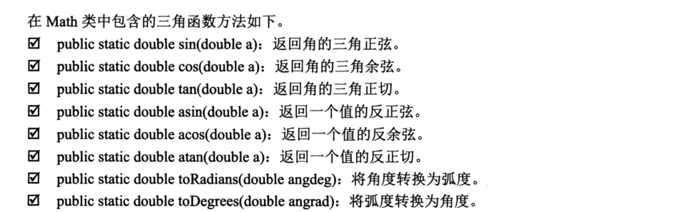

.. contents::
   :depth: 3
..

Math类
======

Math类中提供了众多数学函数方法，主要包括三角函数方法，指数函数方法，取整函数方法，
取最大值、最小值以及平均值函数方法，这些方法都被定义为static形式。

|image0|

eg

::

   public class TrigonometricFunction {
   //  主方法
       public static void main(String[] args) {
   //      取90度的正玄
           System.out.println("90度的正玄值为："+ Math.sin(Math.PI/2));
   //      取0度的余玄
           System.out.println("0度的余玄值为: " + Math.cos(0));
           
   //      取60度的正切
           System.out.println("60度的正切值："+ Math.tan(Math.PI /3));
           
   //      2的平方根与2商的反正玄
           System.out.println("2的平方根与2商的反玄值：" + Math.asin(Math.sqrt(2)/2));
           
   //      2的2次方
           System.out.println("e的平方值："+ Math.exp(2));
           
   //      取4的平方根
           System.out.println("4的平方根值："+ Math.sqrt(4));

   //      取8的立方根
           System.out.println("8的立方根：" + Math.cbrt(8));

   //      取2的2次方
           System.out.println("2的2次方：" + Math.pow(2, 2));
       }

   }
   /*输出结果
   90度的正玄值为：1.0
   0度的余玄值为: 1.0
   60度的正切值：1.7320508075688767
   2的平方根与2商的反玄值：0.7853981633974484
   e的平方值：7.38905609893065
   4的平方根值：2.0
   8的立方根：2.0
   2的2次方：4.0

    */

Math.random()方法
-----------------

::

   public class Math_random {
   //  定义获取任意字符之间的随机字符
       public static char GetRandomChar(char cha1, char cha2) {
           return (char)(cha1 + Math.random()*(cha2 - cha1+1));
           
       }
   //  主方法
       public static void main(String[] args) {
   //      获取a-z之间的随机数
           System.out.println("任意小写字符: " + GetRandomChar('a', 'z'));
   //      获取A-Z之间的随机数
           System.out.println("任意大写字符：" + GetRandomChar('A', 'Z'));
   //      获取0-9之间的随机字符
           System.out.println("0到9之间的任意数字字符：" + GetRandomChar('0', '9'));
           
           
       }

   }

   /*输出结果
   任意小写字符: b
   任意大写字符：G
   0到9之间的任意数字字符：6
    
    */

